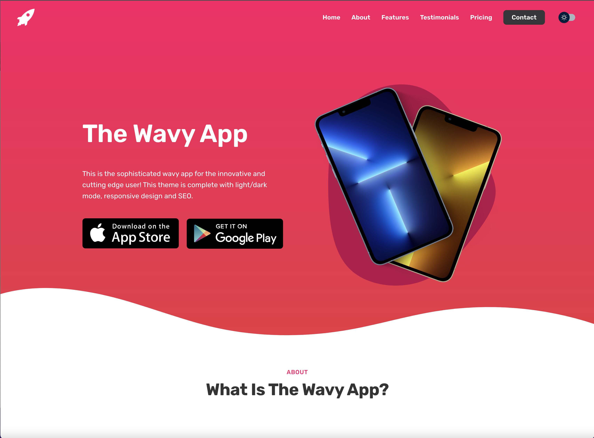

# Wavy App Landing Page

A free app landing page template for iOS or Android apps created by [Gwinyai](https://gwinyai.com). This template was created using HTML, CSS and ReactJS.

## Purpose

This app landing page is meant to speed up your deployment to the App or Play Store. You can use this app landing page as a marketing page and to host your Privacy Policy or Support URL which is required by Apple submission rules.

## Features

- Light/Dark mode functionality.
- Responsive design to adapt to mobile and desktop devices.
- Clean animations that enhance user experience.
- SEO optimized to rank highly in Google.
- Privacy Policy and Support URL pages supported.
- Contact form for feedback from users.
- Easy configuration that requires no code.

## Local Installation

To run the theme locally on your computer, navigate to the directory from terminal or command prompt and install all required node modules.

`npm install`

You should be able to run the theme with this command:

`npm run start`

## Deploy to Github Pages

Simply fork this repo and the project

## Documentation

Download the code and find steps to edit this template in src/config. Each file controls an aspect of the template and includes instructions.

## Need More Customization?

If you would like further customization or help with your app landing page, hire me on [Fiverr](https://www.fiverr.com/gwinyai1312/create-an-app-landing-page-for-your-ios-or-android-app)
